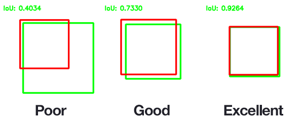

Computing mean average precision
++++++++++++++++++++++++++++++++

**Mean average precision** or **mAP** is an *object-wise* metric to evaluate_generator the discriminative power of a
detection model or a segmentation model.

Its computation involves two steps:
    * Matching the detections (or regressed object masks) to the best corresponding ground truth
    * Computing metrics according to the previously established matches

.. _matching:

Matching detections and ground truths
=====================================

Matching detections to ground truths can itself be divided into 3 steps:

1. Computing a pair-wise similarity index between each detections and
   each ground truths
2. Trimming impossible matches to rule out obvious mismatches
3. Doing the actual match based on the similarity index and the
   detection confidence score

The pair-wise similarity indexes are stored in a matrix called
:math:`\mathcal{S}` and the trimming is equivalent to working on the
similarity matrix :math:`\hat{\mathcal{S}} = \mathcal{S} \circ \Delta`
where :math:`\Delta = (\delta_{i, j})` is :math:`0` on trimmed potential
match and :math:`1` elsewhere and :math:`\circ` is the *Hadamard product*.

All these operations are performed by a :class:`~playground_metrics.match_detections.MatchEngineBase` object.

.. _compute-sym:

Computing the similarity matrix
-------------------------------

The way we compute the similarity matrix depends on the **geometric
type** of the detections and the ground truths:

-  If both detections and ground truths are either **bounding boxes** or
   **polygons**, the preferred method is **Intersection over Union**
   (IoU).
-  If either detections of ground truths are **points**, there are two
   possibilities:

   -  Using the euclidean distance between the **points** and the
      centroid of potential **bounding boxes** or **polygons**
   -  Assigning a fixed size box of polygon to each points and falling
      back to **IoU**

.. _iou:

Intersection over union
~~~~~~~~~~~~~~~~~~~~~~~

Intersection over union or *IoU*—also called Jaccard index—is a measure
of similarity between 2 sets.

As its name suggests it is defined as:

.. math::

   IoU = {{|A \cap B|}\over{|A \cup B|}} = {{|A \cap B|}\over{|A| + |B| - |A \cap B|}}

Where :math:`| \cdot |` denotes the **cardinal** operator.

It may be extended as a geometrical similarity measure by considering
:math:`A` and :math:`B` to be a set of point inside given shapes. Usually,
we take :math:`A` as the set of *predicted points* (as in a segmentation
or a detection task) and :math:`B` the set of *ground truth* points.

The *IoU* is thus defined as:

.. math::

   IoU = \frac{\mathcal{A}(A \cap B)}{\mathcal{A}(A) + \mathcal{A}(B) - \mathcal{A}(A \cap B)}

Where :math:`\mathcal{A}( \cdot )` is the *area* operator.

|IoUbbox| *Example of an IoU computation for bounding boxes (Credits:
Adrian Rosebrock in*\ `Intersection over Union (IoU) for object
detection <http://www.pyimagesearch.com/2016/11/07/intersection-over-union-iou-for-object-detection/>`__\ *)*

The *IoU* is then used to determine how "close" the two shapes are. An
*IoU* of 1 is equivalent to a perfect overlap, which is to say that the
two shape are the same, whereas an *IoU* of 0 means no overlap and
completely different shapes. Example: |IoUpoorgood| *Credits: Adrian
Rosebrock in*\ `Intersection over Union (IoU) for object
detection <http://www.pyimagesearch.com/2016/11/07/intersection-over-union-iou-for-object-detection/>`__\ *)*

However, as one might see in the example before, the IoU decreases much
quicker than overlap, which makes it very scrict metric when working
with small objects.

.. _iiou:

Instance IoU
^^^^^^^^^^^^

To alleviate this issue, the **instance IoU** or **iIoU** was introduced
in the cityscape evaluation to correct the *IoU* by a coefficient of the
area [1].

More precisely, the *iIoU* between a ground truth :math:`G_m` and a
detection :math:`D_n` is defined as:

.. math::

   iIoU(D_n, G_m) = \frac{\overline{\mathcal{A}(G)}}{\mathcal{A}(G_m)} \cdot \frac{\mathcal{A}(D_n \cap G_m)}{\mathcal{A}(D_n) + \mathcal{A}(G_m) - \mathcal{A}(D_n \cap G_m)}

Where :math:`\overline{\mathcal{A}(G)}` is the mean area of all ground
truths of a given class in a given image.

*iIoU* has the advantage of lowering the impact of big ground truth
instances while allowing small instances to be more easily matched.

[1] M. Cordts, M. Omran, S. Ramos, T. Rehfeld, M. Enzweiler, R.
Benenson, U. Franke, S. Roth, and B. Schiele, “\ **The Cityscapes
Dataset for Semantic Urban Scene Understanding,**\ ” in *Proc. of the
IEEE Conference on Computer Vision and Pattern Recognition* (CVPR),
2016.

.. _eds:

Euclidean distance
~~~~~~~~~~~~~~~~~~

The euclidean distance is the usual distance in euclidean geometry. It
is defined as
:math:`|| a - b ||_2  = \sqrt{\langle a - b, a - b  \rangle}` which in 2D
euclidean geometry translates to
:math:`\sqrt{(x_a - x_b)^2 + (y_a - y_b)^2}`.

As defined above, the euclidean distance is a dissimilarity index, the
**euclidean distant similarity index** (EDS) is thus defined as:

.. math::

   \mathcal{D}(a, b) =  1 - \sqrt{(x_a - x_b)^2 + (y_a - y_b)^2}

Such that :math:`a=b \Leftrightarrow \mathcal{D}(a, b) = 1` and
:math:`\mathcal{D}(a, b) \in ]-\infty, 1]`.

.. warning::
    This means that the **EDS** is **not** normalised, as opposed to the **IoU** and that the resulting similarity matrix is **not** sparse.

.. _trim-sym:

Trimming the similarity matrix
------------------------------

The similarity matrix has two type of trimming method types:
threshold-based and membership-based.

The former is straightforward and consist in eliminating similarities
below a certain threshold from possible matches.

It is used by the :class:`~playground_metrics.match_detections.MatchEngineIoU`, :class:`~playground_metrics.match_detections.MatchEngineEuclideanDistance` and :class:`~playground_metrics.match_detections.MatchEngineConstantBox` match engines.

The latter eliminate ``(det, gt)`` in which the detection is not inside
the ground truth or vice-versa. The former is straightforward and
consist in eliminating similarities below a certain threshold from
possible matches.

It is used by the :class:`~playground_metrics.match_detections.MatchEnginePointInBox` match engine.

.. _match:

Matching
--------

The matching contruct the **match matrix**
:math:`\mathcal{M} = (m_{i, j})` where :math:`m_{i, j}` is :math:`1` if the
detection :math:`i` is matched to the ground truth :math:`j` and :math:`0`
otherwise.

There are two types of matching possible:

-  Unitary matching which imposes that a **single** detection can only
   be matched to a **single** ground truth.
-  Non-unitary matching which does not imposes any **unity** in the
   resulting matches: a ground truth could be matched to several
   detections and vice-versa.

Non-unitary matching
~~~~~~~~~~~~~~~~~~~~

Straightforward match for all non-trimmed potential match, i.e.
:math:`\mathcal{M} = \Delta`.

Unitary matching
~~~~~~~~~~~~~~~~

Two match algorithms exist for unitary matches and yield different
matches:

-  The Coco algorithm
-  The xView algorithm

Example case
^^^^^^^^^^^^

Consider the following example where double boxes stand for ground
truths with their id at their right and simple boxes for detection with
their id and confidence at their right:

::

   ┌─────────┐ det1: 0.7
   │         │
   │    ╔════╪═════╗ gt1
   │    ║    │     ║
   └────╫────┘     ║
        ║          ║
        ║     ┌────╫────┐ det2: 0.5
        ║     │    ║    │
        ╚═════╪════╝    │
              │      ╔══╪═════╗ gt2
              └──────╫──┘     ║
                     ║        ║
                     ║        ║
                     ╚════════╝

The corresponding IoU similarity matrix is :

.. math::

   \mathcal{S} =
     \begin{bmatrix}
       0.12 & 0 \\
       0.12 & 0.04
     \end{bmatrix}

Where each row corresponds to a detection a each column to a ground
truth.

Matching algorithms
^^^^^^^^^^^^^^^^^^^

Coco match
''''''''''

Coco match runs trough all detections in decreasing confidence score.
For each detection, we consider a valid match the higest similarity non
previoulsy matched ground truth if its similarity is above a given
threshold.

Consider the example above for an similarity threshold of 0.01:

We first look at ``det1`` because it has the highest confidence, the
biggest similarity in the first row of :math:`\mathcal{S}` is 0.12 at the
fisrt column. 0.12 is above the threshold and ``gt1`` has never been
matched to a detection before so we match ``det1`` to ``gt1``.

We then look at ``det2`` because it has the second highest confidence,
the biggest similarity in the second row of :math:`\mathcal{S}` is also
0.12 at the fisrt column. However ``gt1`` was previosly matched to a
detection before so it is out of the picture, the second biggest
similarity in the second row of :math:`\mathcal{S}` is 0.03 at the second
column. 0.03 is above the threshold and ``gt2`` has never been matched
to a detection before so we match ``det2`` to ``gt2``.

If the threshold is higher than 0.03, say 0.1, we would not be able to
match ``det2`` to ``gt2`` meaning ``det2`` and ``gt2`` would not be
matched to anything, couting respectively as a **False Positive** and a
**False Negative**. Every matched detection count as a **True
Positive**.

xView match
'''''''''''

xView match runs trough all detections in decreasing confidence score.
For each detection, we consider a valid match the higest similarity if
its similarity is above a given threshold and the corresponding ground
truth was never matched before.

Going back to our example:

We first look at ``det1`` because it has the highest confidence, the
biggest similarity in the first row of :math:`\mathcal{S}` is 0.12 at the
fisrt column. 0.12 is above the threshold and ``gt1`` has never been
matched to a detection before so we match ``det1`` to ``gt1``. Just the
same as Coco so far.

We then look at ``det2`` because it has the second highest confidence,
the biggest similarity in the second row of :math:`\mathcal{S}` is also
0.12 at the fisrt column. However ``gt1`` was previosly matched to a
detection before, ``det2`` is thus left unmatched, meaning ``det2`` and
``gt2`` would not be matched to anything, couting respectively as a
**False Positive** and a **False Negative**. Every matched detection
count as a **True Positive**.

Example matching expected results summary
^^^^^^^^^^^^^^^^^^^^^^^^^^^^^^^^^^^^^^^^^

.. _tp-fp-fn--001-similarity:

TP, FP, FN @ 0.01 similarity
''''''''''''''''''''''''''''

+-----------------+-----------------+-----------------+-----------------+
| Match strategy  | True Positive   | False Positive  | False Negative  |
+=================+=================+=================+=================+
| **Coco**        | (``det1``,      | 0               | 0               |
|                 | ``gt1``),       |                 |                 |
|                 | (``det2``,      |                 |                 |
|                 | ``gt2``)        |                 |                 |
+-----------------+-----------------+-----------------+-----------------+
| **xView**       | (``det1``,      | ``det2``        | ``gt2``         |
|                 | ``gt1``)        |                 |                 |
+-----------------+-----------------+-----------------+-----------------+

.. _tp-fp-fn--01-similarity:

TP, FP, FN @ 0.1 similarity
'''''''''''''''''''''''''''

+----------------+---------------------+----------------+----------------+
| Match strategy | True Positive       | False Positive | False Negative |
+================+=====================+================+================+
| **Coco**       | (``det1``, ``gt1``) | ``det2``       | ``gt2``        |
+----------------+---------------------+----------------+----------------+
| **xView**      | (``det1``, ``gt1``) | ``det2``       | ``gt2``        |
+----------------+---------------------+----------------+----------------+

.. |IoUbbox| image:: _static/Intersection_over_Union_-_visual_equation.png

.. _map_computation:

Computation of mAP
==================

Overview
--------

The *mean Average Precision* is, as the name implies, the mean of
*Average Precision* over labels.

Given a set of matched ``(detection, ground truth)`` couple (and
possible unmatched elements, *i.e.* ``(detection, _)`` or
``(_, ground truth)``), the **Precision**/**Recall** curve is computed
using the PASCAL VOC [1] algorithm and the *Average precision* is
defined as the integral of precision with respect to recall.

That is to say that given the :math:`P(R)` function computed below:

.. math::

   AP_n = \int_{0}^{1} P_n(R) \; dR

And

.. math::

   mAP = \frac{1}{N} \sum_{n=1}^{N} AP_n,

where N is the number of labels (or classes).

Precision/Recall
----------------

Precision and recall for each label (or class) are defined as:

.. math::

   P_n = \frac{TP_n}{TP_n + FP_n} = \frac{TP_n}{D_n} \qquad R_n = \frac{TP_n}{TP_n + FN_n} = \frac{TP_n}{G_n} \qquad \qquad (1)

where :math:`TP_n` represents the number of **True Positive** for the n-th
label, :math:`FP_n` represents the number of **False Positive** for the
n-th label, :math:`FN_n` represents the number of **False Negative** for
the n-th label, :math:`D_n` is the number of detection for the n-th label
and :math:`G_n` is the number of ground truth for the n-th label.

To compute the :math:`P(R)` curve, the idea behind the PASCAL VOC
algorithm [1] is to compute an approximate value of precision for
increasingly high recall.

To do so, detections are sorted by decreasing confidence score. We start
at the ``(1, 0)`` point and add detections one by one by following these
rules:

-  If the detection is a **True Positive**, it has a positive effect on
   recall and precision according to :math:`(1)`, we move by a G-th to the
   left and a D-th upward if precision is below 1.
-  If the detection is a **False Positive**, it has a negative effect on
   precision and no effect on recall according to :math:`(1)`, so we move
   downward.

However this method compute an **approximate** precision for a given
recall only and the following curve may be jagged. Before integration,
we remove the jaggedness by interpolating a step function using at all
recall value the maximum precision for all recall more or equal to the
current recall.

The figure below illustrate the approximate precision computation as
well as the anti-jaggedness interpolation:

|ap_compute|

[1] Henderson P., Ferrari V. (2017) **End-to-End Training of Object
Class Detectors for Mean Average Precision.** *In: Lai SH., Lepetit V.,
Nishino K., Sato Y. (eds) Computer Vision – ACCV 2016. ACCV 2016.
Lecture Notes in Computer Science, vol 10115.* Springer, Cham.
https://link.springer.com/chapter/10.1007%2F978-3-319-54193-8_13

